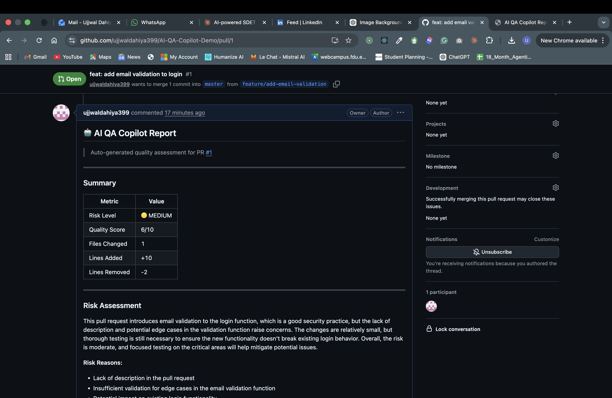

## Ujjwal Dahiya — SDET Co-op Candidate

**I build test infrastructure where the AI is the tester — not just a tool the tester uses.**

📍 Langley, BC &nbsp;|&nbsp; MSc Applied Computer Science, Fairleigh Dickinson University &nbsp;|&nbsp; Open to SDET Co-op — Sept 2026

---

### What makes my work different

Most SDET candidates automate tests. I build systems that autonomously detect failures, classify them, heal broken selectors, and post structured QA reports — all without human intervention.

---

### AI QA Copilot — PR opened → AI reviews code → report posted to GitHub automatically

Every pull request triggers an LLaMA 3.3 70B review via Groq API. Risk level, quality score, generated test cases, and security checks — posted as a structured GitHub comment. No human reviewer needed to catch the first pass.

→ [See the project](https://github.com/ujjwaldahiya399/AI-QA-Copilot)

---

### Projects

| Project | The problem it solves |
|---------|----------------------|
| [AI QA Copilot](https://github.com/ujjwaldahiya399/AI-QA-Copilot) | Automated code review on every PR — risk assessment, test cases, security checks posted to GitHub |
| [Self-Healing Playwright Tests](https://github.com/ujjwaldahiya399/Self-Healing-Playwright-Tests-with-AI) | Broken DOM selectors detected and fixed at runtime by LLM — no manual test maintenance |
| [Visual Regression with AI](https://github.com/ujjwaldahiya399/visual-regression-testing-with-AI-diff-analysis) | Pixel diffs classified as genuine bug vs intentional change — cuts false-positive triage time |
| [AI Test Case Generator](https://github.com/ujjwaldahiya399/AI-test-case-generator-using-Groq-API) | Feature requirements in → structured pytest test cases out · Dockerized · CI/CD on every push |
| [AI Test Data Generator](https://github.com/ujjwaldahiya399/AI-test-data-generator-with-HTML-report-and-retry-mechanism) | JSON schema in → categorised realistic test datasets + HTML report · built-in retry logic |

---

### Stack

`Python` `Playwright` `pytest` `Selenium` `Docker` `GitHub Actions` `Groq API` `LLaMA 3.3 70B` `Postman` `JIRA` `Linux`

---

### Connect

[LinkedIn](https://linkedin.com/in/ujjwal-dahiya) &nbsp;·&nbsp; [Email](mailto:ujjwaldahiya350@gmail.com) &nbsp;·&nbsp; [Docker Hub](https://hub.docker.com/r/dahiyaujjwal/ai-test-case-generator)
